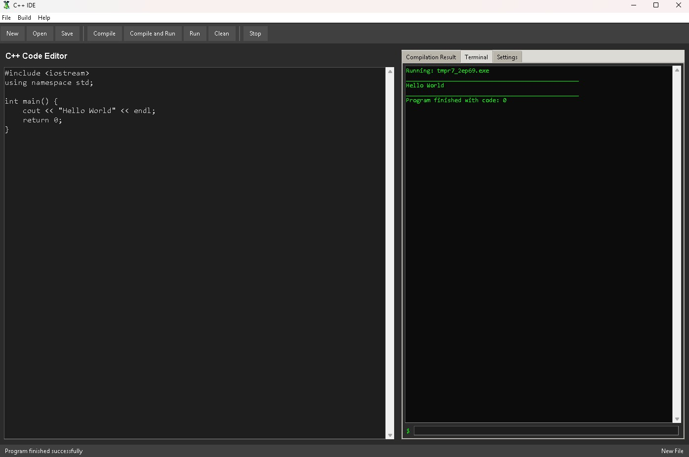

<p align="center"></p>

## C++ IDE

C++ IDE is a fully functional integrated development environment (IDE) created in Python using the Tkinter library.


---

## Features

- 📝 Code editor
- ⚙️ C++ compilation and execution
- 💻 Interactive terminal
- 🔧 Compiler configuration
- 📚 Support for multiple C++ standards
- ⌨️ Keyboard shortcuts

<table>
  <tr>
    <th>Shortcut</th>
    <th>Description</th>
  </tr>
  <tr>
    <td>Ctrl+N</td>
    <td>New file</td>
  </tr>
  <tr>
    <td>Ctrl+O</td>
    <td>Open file</td>
  </tr>
  <tr>
    <td>Ctrl+S</td>
    <td>Save file</td>
  </tr>
  <tr>
    <td>F5</td>
    <td>Compile</td>
  </tr>
  <tr>
    <td>F6</td>
    <td>Compile and run</td>
  </tr>
  <tr>
    <td>F7</td>
    <td>Run</td>
  </tr>
</table>

---

## Required libraries  
The application uses the following Python modules:

```python
import tkinter as tk
from tkinter import ttk, scrolledtext, messagebox, filedialog
import subprocess
import threading
import os
import sys
from pathlib import Path
import tempfile
import queue
import time
```

## Installation

1. Clone the repository

```bash
git clone https://github.com/DrTrefl/CppIDE.git
cd CppIDE
cd src
```

2. Run the application

```bash
python CppIDE.py
```

---

## Screenshots

<p align="center"></p>

---

Thank you for your interest in my project.
